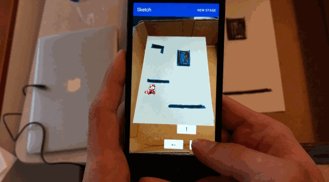

## Mario Sketchbook

Mario Sketchbook is a pen-and-paper platformer. On paper, the user can draw a game world with their own desired objects and platforms. The app captures their hand-drawn world and adds Mario to it! Mario can run and jump around on the drawn shapes.

This app was built at UB Hacking 2017 in Buffalo, NY.

**[Watch a video demo](https://youtu.be/sckjbGo1e6I)**

### Screenshots

